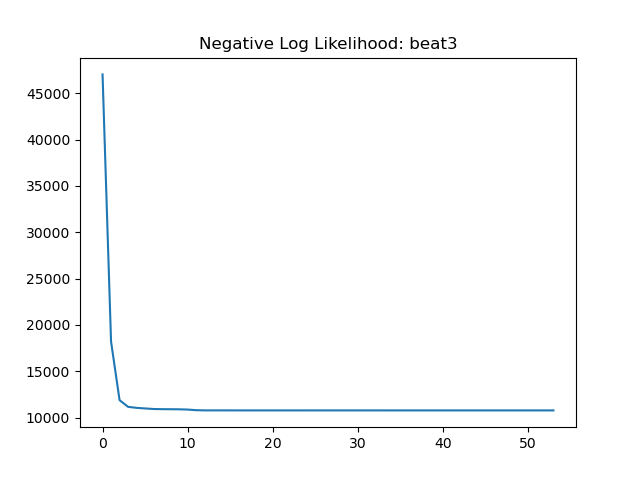

# Introduction
In this project, I developed and trained a Hidden Markov Model (HMM) on accelerometry data for motion classification. Reproducible code is available as a [git repository](https://github.com/fyng/hmm_accelerometry.git
)


# Problem Statement
Given an array of IMU sensor reading from gyroscopes and accelerometers, classify the motion into one of ['beat3', 'beat4', 'circle', 'eight', 'inf', 'wave'].


# Data
The IMU data contains 7 columns: ts , Wx, Wy, Wz, Ax, Ay, Az (Time (millisecond), 3x Gyroscope (rad/sec), 3x Accelerometer (m/s2) ).


# Approach
We frame the problem as a HMM that emits in the discrete space. An HMM is trained on discretized IMU data for each motion class, therefore we trained a total of 6 HMMs for the 6 motion classes. In the test setting, the HMMs indepedently score the unseen data and the HMM that reports the highest probability is used to assign the class label.

My pipeline consists of the following:
1. Discretization with K-means: given a [n,7] sized array of IMU data, were the 7 columns are ts , Wx, Wy, Wz, Ax, Ay, Az, return a [n,1] array of discretized IMU, where the number of discrete states is a user-chosen parameter.
2. HMM training: An HMM is independently trained for each type of motion in the training dataset. 
3. Classification: Each HMM (trained on one class of motion) scores the test data and produces a log-likelihood. The HMM with the highest log-likelihood is used to assign the classification label. (e.g. if `hmm_wave` gives the test data the highest log-likelihood, the test data is classified as 'wave').


## 1. IMU discretization with K-means 
To discretize continous IMU data, we train a K-means (KNN) classifier. All training data is concatenated and the `ts` column is stripped out, before being fed into the K-means classifier. The same K-means classifier is then used to discretize the validation and test sets. The number of clusters is a user-chosen parameter, and we used `n_clusters = 50` for all following experimentations as it worked well on the validation dataset. 

It is worth noting that such an approach to discretization is sensitive to distribution shift (e.g. from a miscalibrated sensor). Preprocessing steps such as sensor data normalization may be a useful improvement to the current workflow.

Refer to the visualization of discretized IMU signals in the [appendix](##-IMU-quantization)


## 2. Hidden Markov Mode
HMM is a probabilistic model over sequential data of arbitrary length. To efficiently handle arbitrary sequence lengths, the model uses the Markov assumption: the future state conditioned on the current state is independent of all past states. Simply put, whatever relevant information from the past for predicting the future is fully manifested in the present. 

The HMM uses hidden states as internal representations for the data space. The model is parameterized by a transition matrix $A$, emission matrix $B$, and initialization probability $\pi$. $A \in R^{n_{hidden} \times n_{hidden}}$ parameterizes the transition probability between hidden states, where $A_{ji}$ is the probability that state $i$ transitions to state $j$. $B \in R^{n_{hidden} \times n_{clusters}}$ parameterizes the mapping between hidden states and observed states, where $B_{jk}$ is the probability that hidden state $j \in n_{hidden}$ emits observed state $k \in n_{clusters}$. 

My implementation makes several adjustments to the vanilla HMM:
1. Scaling to prevent underflow: Over arbitrarily long sequence, the probability of observing the sequence under the model $p(X | \Lambda)$ becomes small and runs into underflow. To address this, I use the scaling method introduced by Rabiner in Section V of the [paper](https://www.cis.upenn.edu/~cis2620/notes/HMM-tutorial-Rabiner.pdf). Briefly, a scaling factor is calculated for every timestep to normalize $p(X | \Lambda, \pi)$ to 1, and the scaling factor is stored for calculating log-likelihood.

2. The initialization probability $\pi$ is NOT learned. For a given class of motion, the corresponding HMM always initializes at the first hidden state. This is a valid simplifying assumption _as long as the experimental procedure always start the measurement in the same way within a type of motion_. Inconsistencies between classes of motion will not affect the results since the models are trained independently. 

3. A left-to-right transition matrix $A$ is enforced through the following initialization, which enforce a forward progression through the hidden states and helps convergence. Transition from the last to the first state is allowed to account for the motion repeating multiple times in one training instance: 
$$
\mathbf{A_0} = \begin{pmatrix}
0.9 & 0 & \cdots & 0.1 \\
0.1 & 0.9 & \cdots & 0 \\
\vdots & \vdots & \ddots & \vdots \\
0 & 0 & \cdots & 0.9
\end{pmatrix}
$$

To train the HMM, all training data for each category of motion is concatenated (training the same model $n$ times and concatenating all $n$ datapoints is exactly the same sequence of operations). The transition probability from the final to first hidden state takes care of the repeated motion introduced by concatenation. Each class of motion data trains it's own HMM, and each HMM does not see any other class of motion during training.  

All models trained to convergence, refer to the [loss curves in the appendix](##-Loss-curves-for-HMM-training)


## 3. Classification


# Results
**Test dataset:**

```
test7.txt: 
 top-1: wave 
 top-3: ['wave', 'eight', 'beat3']
test6.txt: 
 top-1: eight 
 top-3: ['eight', 'inf', 'wave']
test4.txt: 
 top-1: beat4 
 top-3: ['beat4', 'beat3', 'wave']
test5.txt: 
 top-1: circle 
 top-3: ['circle', 'beat4', 'beat3']
test1.txt: 
 top-1: inf 
 top-3: ['inf', 'eight', 'beat3']
test2.txt: 
 top-1: beat4 
 top-3: ['beat4', 'beat3', 'inf']
test3.txt: 
 top-1: inf 
 top-3: ['inf', 'eight', 'beat3']
test8.txt: 
 top-1: beat4 
 top-3: ['beat4', 'beat3', 'wave']
```
---

Train split:
```
wave03.txt: 
 top-1: wave 
 top-3: ['wave', 'beat3', 'eight']
wave02.txt: 
 top-1: wave 
 top-3: ['wave', 'beat3', 'eight']
wave01.txt: 
 top-1: wave 
 top-3: ['wave', 'beat3', 'beat4']
wave05.txt: 
 top-1: wave 
 top-3: ['wave', 'beat3', 'eight']
wave07.txt: 
 top-1: wave 
 top-3: ['wave', 'beat3', 'eight']
circle18.txt: 
 top-1: circle 
 top-3: ['circle', 'beat4', 'beat3']
eight02.txt: 
 top-1: eight 
 top-3: ['eight', 'inf', 'wave']
inf13.txt: 
 top-1: inf 
 top-3: ['inf', 'eight', 'beat3']
beat4_05.txt: 
 top-1: beat4 
 top-3: ['beat4', 'beat3', 'inf']
inf11.txt: 
 top-1: inf 
 top-3: ['inf', 'eight', 'beat3']
eight01.txt: 
 top-1: eight 
 top-3: ['eight', 'inf', 'wave']
inf112.txt: 
 top-1: inf 
 top-3: ['inf', 'eight', 'beat3']
eight04.txt: 
 top-1: eight 
 top-3: ['eight', 'inf', 'wave']
beat4_01.txt: 
 top-1: beat4 
 top-3: ['beat4', 'beat3', 'inf']
beat3_08.txt: 
 top-1: beat3 
 top-3: ['beat3', 'beat4', 'wave']
beat4_03.txt: 
 top-1: beat4 
 top-3: ['beat4', 'beat3', 'inf']
eight07.txt: 
 top-1: eight 
 top-3: ['eight', 'inf', 'wave']
inf16.txt: 
 top-1: inf 
 top-3: ['inf', 'eight', 'beat3']
beat3_06.txt: 
 top-1: beat4 
 top-3: ['beat4', 'beat3', 'inf']
inf18.txt: 
 top-1: inf 
 top-3: ['inf', 'eight', 'beat3']
circle12.txt: 
 top-1: circle 
 top-3: ['circle', 'beat4', 'beat3']
eight08.txt: 
 top-1: eight 
 top-3: ['eight', 'inf', 'wave']
circle13.txt: 
 top-1: circle 
 top-3: ['circle', 'beat4', 'beat3']
beat4_09.txt: 
 top-1: beat4 
 top-3: ['beat4', 'beat3', 'eight']
circle17.txt: 
 top-1: circle 
 top-3: ['circle', 'beat4', 'beat3']
beat3_01.txt: 
 top-1: beat3 
 top-3: ['beat3', 'beat4', 'wave']
beat4_08.txt: 
 top-1: beat4 
 top-3: ['beat4', 'beat3', 'wave']
beat3_03.txt: 
 top-1: beat3 
 top-3: ['beat3', 'beat4', 'wave']
circle14.txt: 
 top-1: circle 
 top-3: ['circle', 'beat4', 'beat3']
beat3_02.txt: 
 top-1: beat3 
 top-3: ['beat3', 'beat4', 'wave']
```

Validation split:
```
circle31.txt: 
 top-1: circle 
 top-3: ['circle', 'beat4', 'beat3']
beat3_31.txt: 
 top-1: beat3 
 top-3: ['beat3', 'beat4', 'wave']
inf31.txt: 
 top-1: inf 
 top-3: ['inf', 'eight', 'beat3']
beat4_31.txt: 
 top-1: beat4 
 top-3: ['beat4', 'beat3', 'inf']
eight31.txt: 
 top-1: eight 
 top-3: ['eight', 'inf', 'wave']
```

# Appendix
## IMU quantization
 
 
 


## Loss curves for HMM training
 
 
 


